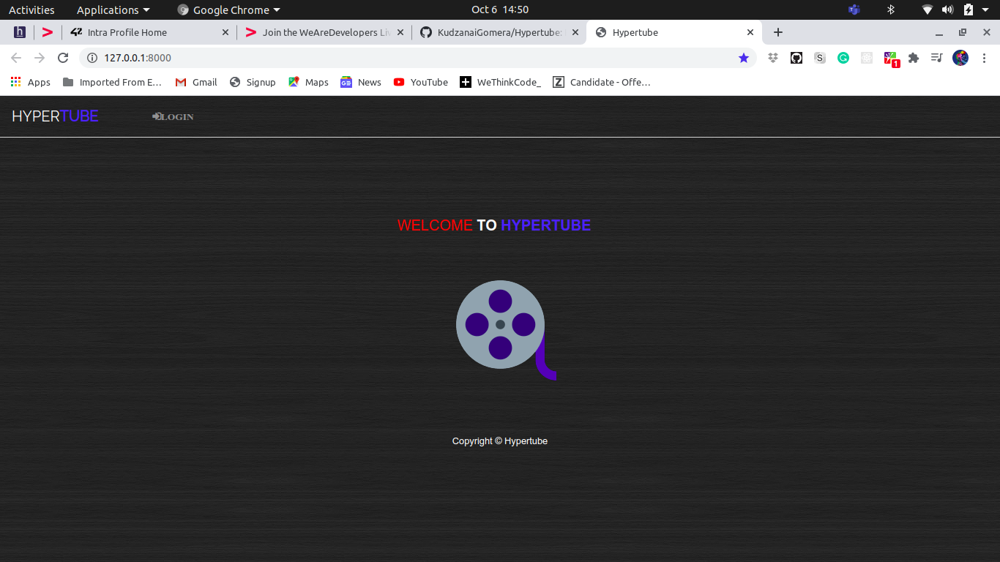
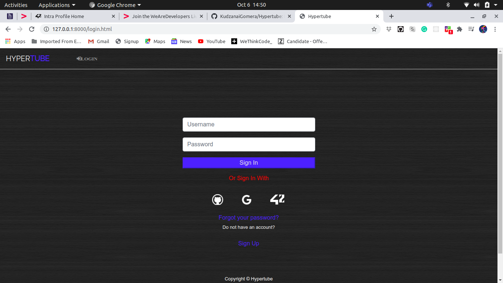
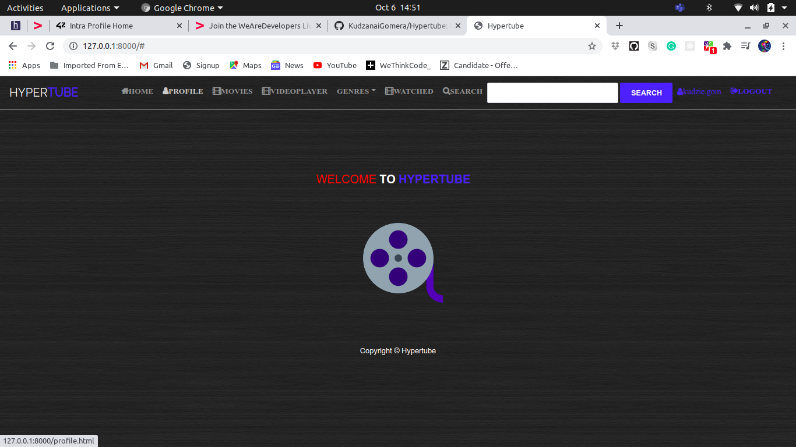
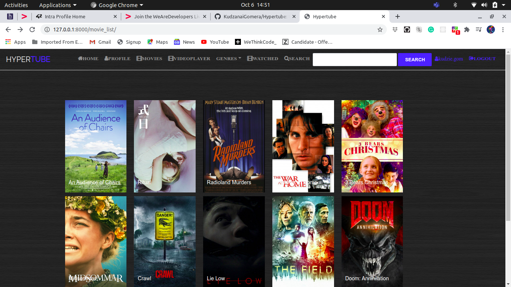
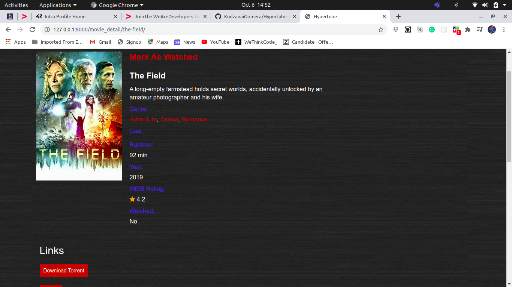

# Hypertube
This project proposes to create a web application that allows the user to research and watch videos.

# The player will be directly integrated to the site, and the videos will be downloaded
through the BitTorrent protocol.

# The research engine will interrogate multiple external sources of your choice, like for
example http://www.legittorrents.info, or even https://archive.org.
Once the element selected, it will be downloaded from the server and streamed on the
web player at the same time. Which means that the player won’t only show the video
once the download is completed, but will be able to stream directly the video feed.

# How To Run

run the bash script

$ cd hypertube

$ sh import.sh

$ pip3 install -r requirements

$ python3 manage.py makemigrations

$ python3 manage.py migration

$ python3 manager.py runserver

$ make sure you have mysql server running for db. if you have phpmyadmin (on windows drage the hypertube folder inside htdocs)(on linux just run your server)

# Used MVT

- Model ---> Data eg from db

- View ---> Logic 

- Template ---> Django,template, language(DTL) html, css and js

# Django Commands:

 ## Creating DB 
 
 - python3 manage.py makemigrations 
 - python3 manage.py migrate (appname) and (version number) eg. appname= app and version number= 0001

 # Outline:
    - title
    - description
    - tags
    - views count
    - image
    - category
    - language
    - year of production
    - status [recently added - most watched - top rated]
    - download links
    - watch links
    - related movies

- search
- Download torrent
- stream torrent
- search from external sources

